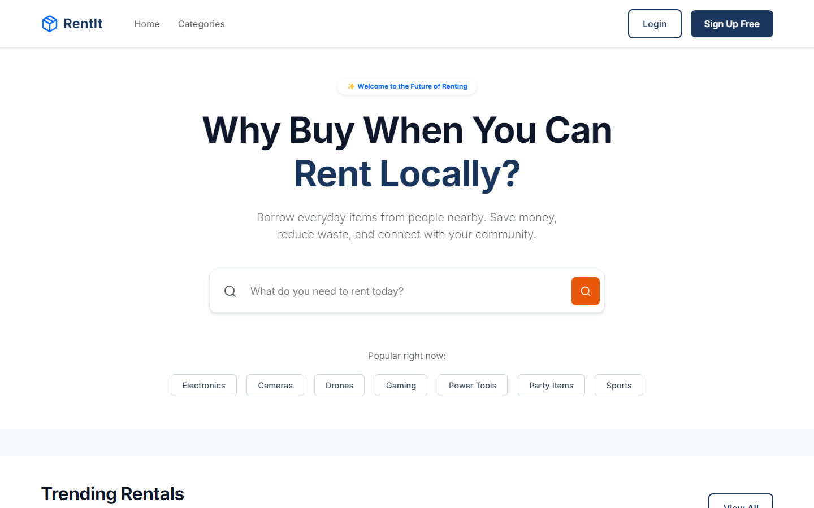
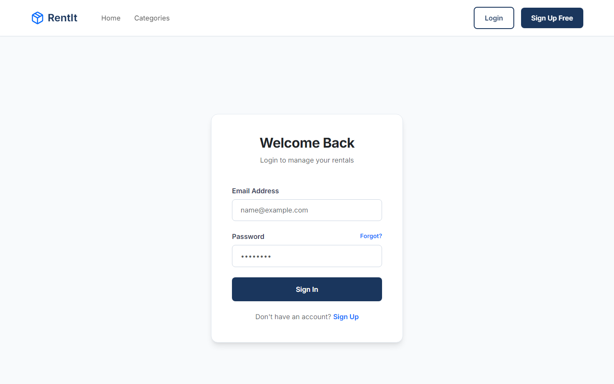
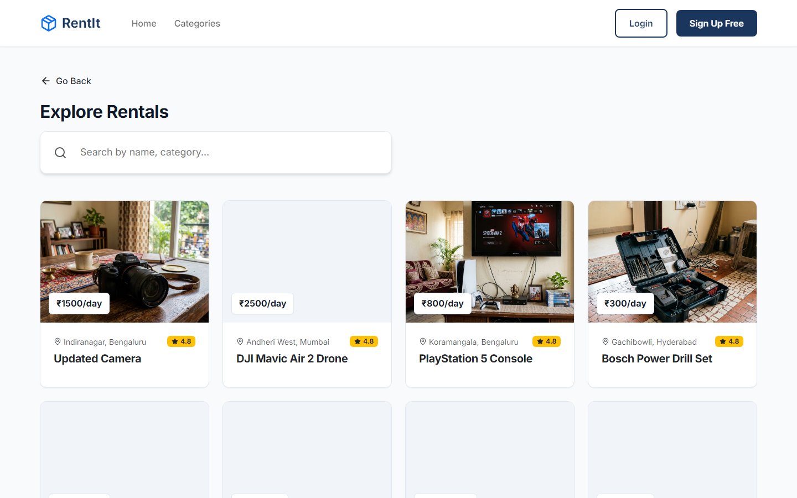
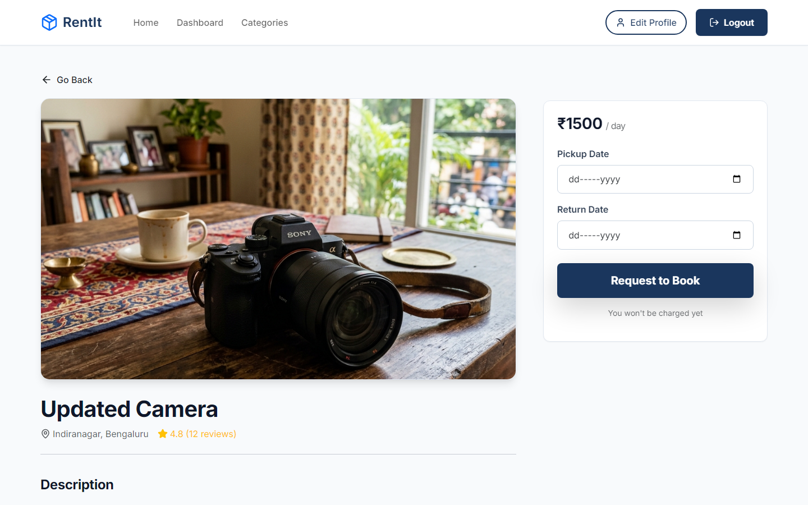
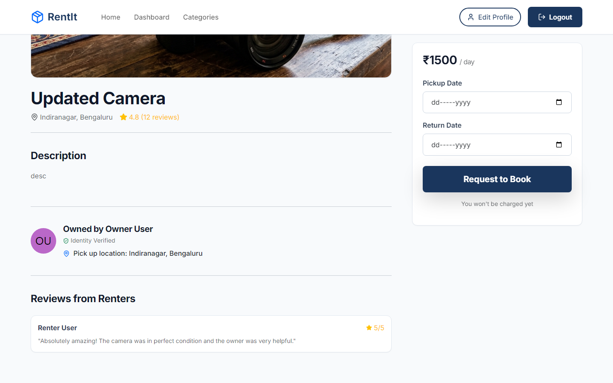
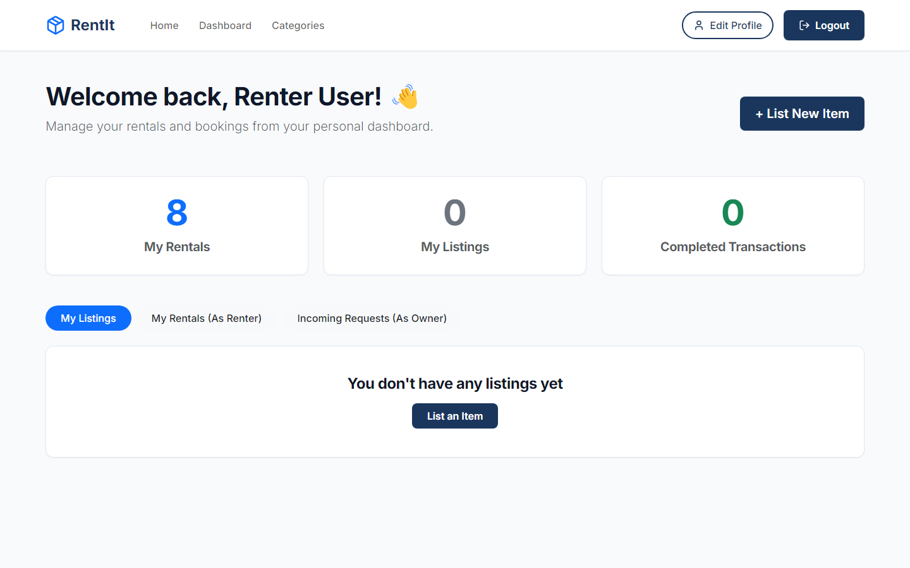
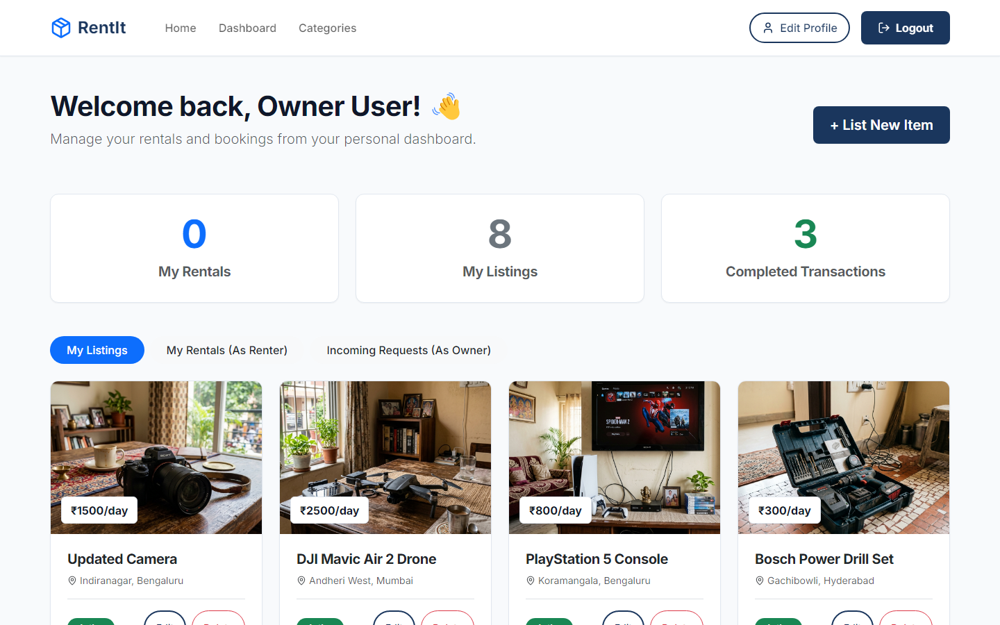
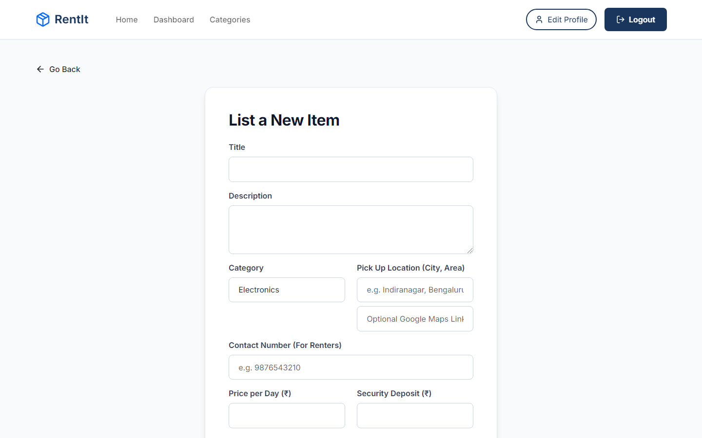

# RentIt – Rent Anything Locally



**Live Deployment:** [https://rentit-app-ochre.vercel.app](https://rentit-app-ochre.vercel.app)

### 🔑 Test Credentials
To explore the platform without registering, you can use these seeded test accounts:

**Owner Account** (Has listings and incoming requests)
* **Email:** `owner@example.in`
* **Password:** `123456789`

**Renter Account** (Has past bookings and can rent items)
* **Email:** `renter@example.in`
* **Password:** `123456789`
RentIt is a modern, full-stack web application designed to empower communities by allowing users to rent out their idle items (like electronics, tools, vehicles, and party supplies) and enabling others to borrow them locally. Built with the **MERN Stack** (MongoDB, Express, React, Node.js), it features a highly dynamic, responsive, and visually stunning user interface with premium glassmorphism aesthetics.

---

## 🚀 Key Features

* **Secure Authentication:** JWT-based login and registration for secure user sessions.
* **Dual-Role Dashboards:** Dedicated experiences for both Renters and Owners to track activities.
* **Advanced Search & Filtering:** Find exactly what you need with location, category, and date-based filtering.
* **Seamless Booking System:** Real-time availability checks and instant booking workflows.
* **Item Management:** Easy process for owners to list, edit, and manage their rental items.
* **Modern UI/UX:** High-end, vibrant glassmorphism design with smooth CSS micro-animations.
* **Responsive Design:** Completely optimized for mobile, tablet, and desktop devices.

---

## 🛠️ Technology Stack

* **Frontend:** React.js, Vite, Bootstrap, Vanilla CSS (for custom glassmorphism & animations), Lucide React (Icons).
* **Backend:** Node.js, Express.js.
* **Database:** MongoDB with Mongoose ODM.
* **Authentication:** JSON Web Tokens (JWT) & bcrypt.js.
* **Deployment:** Vercel (Frontend).

---

## 📸 Application Walkthrough

### 1. Home / Landing Page
The landing page provides a stunning first impression with a vibrant hero section, quick search bar, and featured rental categories. It immediately communicates the value of the platform.


### 2. User Authentication (Login / Register)
Secure access to the platform. The UI uses glassmorphism to keep the vibrant background visible while providing clear, readable forms for entering credentials.



### 3. Search & Discover Items
Users can browse available items in their locality. The search interface is intuitive, allowing filtering by categories, price, and availability.



### 4. Item Details
When a user clicks on an item, they get a comprehensive view including high-quality images, descriptions, owner details, rental rules, and pricing.



### 5. Booking Process
The booking interface allows users to select their required dates, instantly calculates the total cost, and processes the rental agreement smoothly.



### 6. User Dashboards
The application features distinct dashboard views depending on the user's role:
* **Renter Dashboard:** Track active rentals, past history, and upcoming bookings.
* **Owner Dashboard:** Manage listed items, view earnings, and approve/reject booking requests.




### 7. List a New Item
A streamlined form for owners to add new items to the platform, complete with image uploads, pricing configuration, and availability settings.



---

## 🏗️ Project Architecture & Setup

### Folder Structure
```text
RentIt/
├── client/ (React + Vite Frontend)
│   ├── src/
│   │   ├── components/ (Reusable UI like Navbar, Footer)
│   │   ├── pages/ (Main views like Home, Login, Dashboard)
│   │   └── App.jsx & index.css
│   └── package.json
│
├── server/ (Node + Express Backend)
│   ├── controllers/ (Business logic)
│   ├── middleware/ (Auth & Validation)
│   ├── models/ (Mongoose Schemas: User, Item, Booking)
│   ├── routes/ (API Endpoints)
│   └── server.js
│
└── database/ (MongoDB Local/Cloud Data)
```

### Running Locally

1. **Clone the Repository**
   ```bash
   git clone https://github.com/mscharan1810/RentIt.git
   cd RentIt
   ```

2. **Backend Setup**
   ```bash
   cd server
   npm install
   cp .env.example .env  # Configure your MONGO_URI and JWT_SECRET
   npm run dev
   ```

3. **Frontend Setup**
   ```bash
   cd ../client
   npm install
   npm run dev
   ```
   *The React application will be available at `http://localhost:5173/`.*

---

## 🔗 API Endpoints

### Auth Routes
* `POST /api/auth/register` - Register a new user
* `POST /api/auth/login` - Authenticate user & return JWT

### Item Routes
* `GET /api/items` - Fetch all available items
* `GET /api/items/:id` - Fetch single item details
* `POST /api/items` - Create a new item listing (Requires Auth)

### Booking Routes
* `POST /api/bookings` - Create a new booking (Requires Auth)
* `GET /api/bookings/user` - Get all bookings for a user (Requires Auth)

---
*Built for the community, to share more and waste less.*
